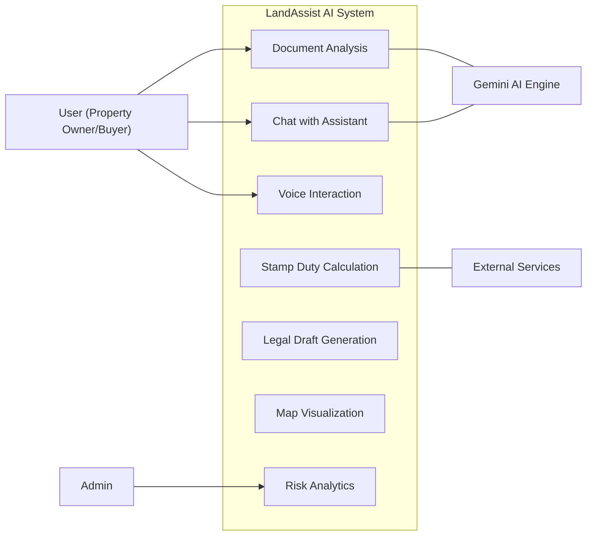
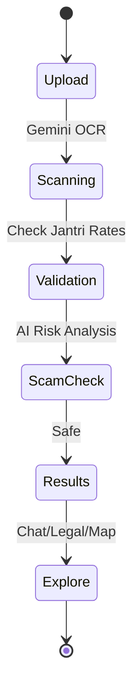
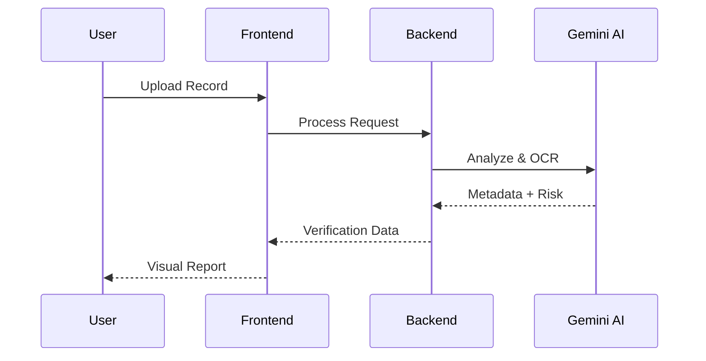

# 🏗️ LandAssist AI: Smart Land Document Analysis & Registry Assistant

[](https://opensource.org/licenses/MIT)
[](https://reactjs.org/)
[](https://nodejs.org/)
[](https://www.mongodb.com/)
[](https://ai.google.dev/)

**LandAssist AI** is a state-of-the-art intelligent system designed to revolutionize land registry and document analysis. Leveraging Google's **Gemini 2.5 Flash**, it provides automated OCR, fraud detection, legal drafting, and real-time voice assistance for land-related transactions in Gujarat, India.

> [!TIP]
> **Check out our [Project Wiki](https://github.com/Pritpatel11/AI-Based-Smart-Land-Document-Analysis-Registry-Assistant-System/wiki)** for detailed architecture, API reference, and setup guides!

---

## 🌟 Key Features

- **🚀 AI Document Analysis:** Instant OCR and metadata extraction from Index-II and 7/12 land records.
- **🛡️ Scam Detection:** Real-time risk assessment to identify forged documents or duplicate ownership claims.
- **💬 Unified Chat Interface:** A seamless AI assistant that follows you from the dashboard to deep document analysis.
- **🎙️ Native Voice AI:** Real-time speech-to-speech interaction using high-fidelity AI voices.
- **⚖️ Legal Automation:** Automated generation of Sale Deeds, Affidavits, and Agreements based on analyzed data.
- **📍 Smart Mapping:** Visualizes land parcels on interactive maps directly from survey numbers.
- **💰 Financial Tools:** Integrated Stamp Duty Calculator and Loan Eligibility Checker based on current Jantri rates.

---

## 🏗️ System Architecture

### 1. Use Case Diagram
Describes how users and admins interact with the system components.



### 2. Activity Diagram
Displays the core workflow from document upload to actionable results.



### 3. Sequence Diagram
Visualizes the real-time communication between layers.



---

## 🛠️ Tech Stack

- **Frontend:** React.js, Vite, Framer Motion (Animations), Tailwind CSS/Vanilla CSS, Lucide React.
- **Backend:** Node.js, Express.js.
- **Database:** MongoDB Atlas (with Vector Search).
- **AI/ML:** Google Gemini 2.5 Flash API (Live WebSockets, Multimodal OCR).
- **Security:** JWT Authentication, Secure API Proxies.

---

## 🚀 Getting Started

### Prerequisites

- Node.js (v18+)
- MongoDB Atlas Account
- Google AI Studio API Key (Gemini)

### Installation

1. **Clone the repo:**
   ```bash
   git clone https://github.com/Pritpatel11/AI-Based-Smart-Land-Document-Analysis-Registry-Assistant-System.git
   ```

2. **Backend Setup:**
   ```bash
   cd backend
   npm install
   # Create .env file with:
   # PORT=5000
   # MONGO_URI=your_mongodb_uri
   # JWT_SECRET=your_secret
   # GEMINI_API_KEY=your_key
   npm start
   ```

3. **Frontend Setup:**
   ```bash
   cd frontend
   npm install
   npm run dev
   ```

---

## 📁 Project Structure

```text
├── backend/
│   ├── models/        # Mongoose Schema
│   ├── routes/        # API Endpoints
│   ├── utils/         # AI & Legal Services
│   └── server.js      # Entry point
├── frontend/
│   ├── src/
│   │   ├── components/# Reusable UI
│   │   ├── context/   # Global State (Chat/Journey)
│   │   ├── pages/     # Main Views (Analysis, Home)
│   │   └── App.jsx    # Split-screen Layout
```

---

## 📄 License

This project is licensed under the MIT License - see the [LICENSE](LICENSE) file for details.

---

**Developed with ❤️ by [Prit Patel](https://github.com/Pritpatel11)**
